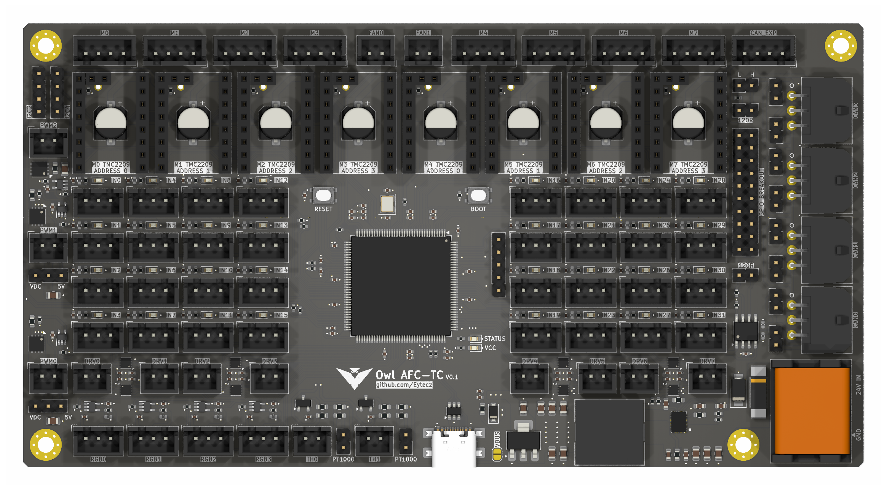

# Owl AFC-TC Expansion Board

The **Owl AFC-TC** is an open-source expansion board for advanced multi-toolhead 3D printers running Klipper firmware. It is designed to support high-performance, modular printing systems with automatic filament changers and CAN-connected toolheads.

This board was inspired by the [AFC-Lite project by xbst](https://github.com/xbst/AFC-Lite) and builds upon its foundation with a broader feature set, more I/O, and support for complex toolchanger configurations. It is also compatible with the [AFC Klipper Add-On](https://github.com/ArmoredTurtle/AFC-Klipper-Add-On), allowing seamless integration into Klipper-controlled systems.

The Owl AFC-TC board is built to control up to **4 toolheads** and **4 independent filament changers**, each capable of handling **2 spools**, for a total of 8 spools in a fully automated, multi-material 3D printer.

---

## Use Case

This board is designed for advanced 3D printing setups involving:
- Multi-toolhead configurations
- Automatic filament changers (boxturtle-style or custom)
- CAN-based modular communication
- Centralized I/O for distributed printer components

Its modular design enables high scalability and flexibility while minimizing wiring complexity in your printer.

---

## Documentation and Files

This repository includes:
- KiCad project files (schematics and PCB)
- Bill of materials (BOM)
- 3D models and board previews
- Example wiring diagrams
- Klipper configuration examples

Documentation will be expanded over time to include build guides, pinouts, and integration tutorials.

---

## License

This project is licensed under the  
**Creative Commons Attribution-NonCommercial-ShareAlike 4.0 International License**.  
You may use, modify, and share the design for non-commercial purposes with proper attribution and under the same license terms.

For more information, see:  
[https://creativecommons.org/licenses/by-nc-sa/4.0/](https://creativecommons.org/licenses/by-nc-sa/4.0/)
